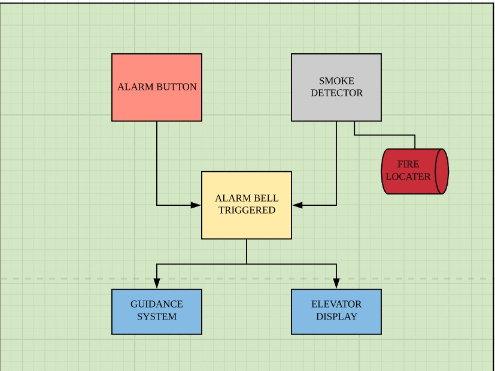

# TeamName-SolutionName_SCDFXIBM
SCDFxIBM call for code 2020 | Team members: Tan Jia Xin, Franky Lim, Hwang Jihun | Singapore Polytechnic

**Content**

**1**. A short description of the problem you are tackling, how technology can help, as well as the idea your team is proposing*

**What's the problem?**

When a building is burning, some people might not know where to go, the surroundings might be dark, unclear or blocked. In this case, people are helpless and might get injured and can only wait for help to arrive. Especially in a venue that is big and have no clear directions where to go. Fires might also spread to areas without people knowing and can cause a problem to firefigters. 

**How can technology help?**

With the help of internet of things, we can integrate devices together and have them work in the same system with easy monitoring.

**The idea**

A system connecting smoke detectors, fire alarms, floor LEDs and elevator displays together to show a safe emergency evacuation route for people to follow to safety. Which serves as a good way to show people the way in case there is no light or when there is heavy smoke in the air or the exit signs are not visible.

How it works:
Fire triggers smoke detector which triggers the alarms
The IOT systems activate which then activate the lights in the floor which flows according to the direction to take
The elevator display also shows “Please do not use - follow the flowing lights on the floor to the nearest exit”
Once smoke is detected in the area, the system will be updated to avoid going to the direction, displaying the lights flowing away from there (which might also help firefighter find the fire faster)
The system will also recalculate the new fastest and safest path to the emergency exit and assembly point
The lights on the floor will show the safest way to evacuation gathering point where people will be safe and can wait for help
Display of the fire location, will also be shown on the display near the lift

**2**. Pitch video: https://youtu.be/Pj-qUqQF0S4

**3**. The architecture of your proposed solution

**4**. A hyperlink to your detailed solution :

**5**. Project Roadmap/ Proposed timeline

**6**. Getting started* (Step-by-step instructions to install the required software and how to run a demo of your solution)

**7**. Running the tests (Explanation and breakdown on how to run tests for the proposed solution)

**8**. Live demo (Link to an actual working demo/website)

**9**. What your team used to build your solution

IBM Internet of Things watsons platform (https://cloud.ibm.com/catalog/services/internet-of-things-platform)

